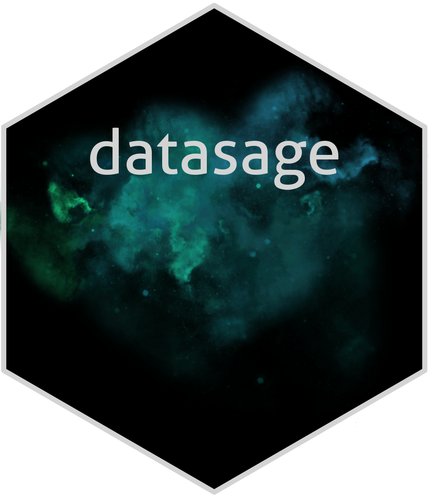

`datasage` is a Python library that provides a collection of tools for data analysis and machine learning. The package includes functionalities for data preprocessing, predictive modeling and advanced visualization, with a particular focus on ease of use and efficiency.

## Key Features
- Data preprocessing
- Modeling tools with integrated Bayesian optimization
- Customizable visualizations with predefined dark and light themes

## Installation

```
pip install git+https://github.com/carminemnc/datasage.git
```

## Usage

For using predefined themes

```python
from datasage.styles import DARK_THEME,LIGHT_THEME
```
Direct usage

```python
plt.style.use(DARK_THEME)
```
or
```python
with theme('dark'):
    plt.plot([1, 2, 3])
    plt.title('Dark theme plot')
```