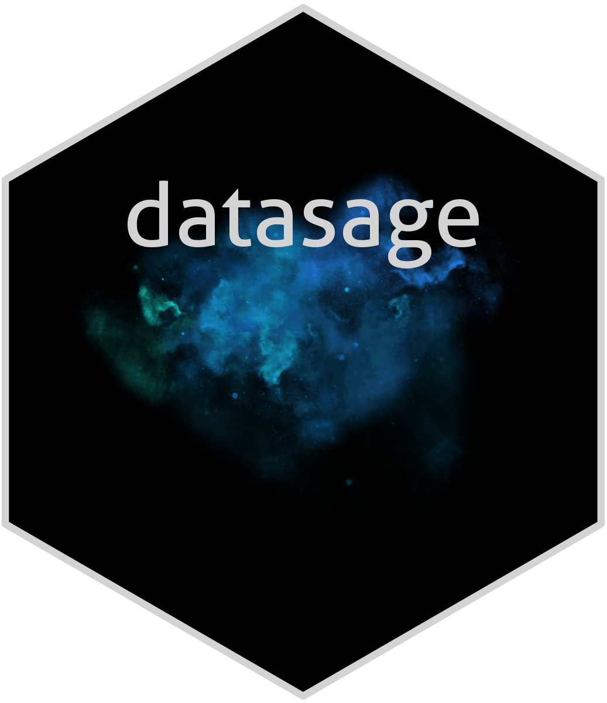

# datasage

`datasage` is a Python library that provides a collection of tools for data analysis and machine learning. The package includes functionalities for data preprocessing, predictive modeling, and advanced visualization, with a particular focus on ease of use and efficiency.

## Key Features
- Data preprocessing with advanced normalization and outlier management capabilities
- Modeling tools with integrated Bayesian optimization
- Customizable visualizations with predefined dark and light themes